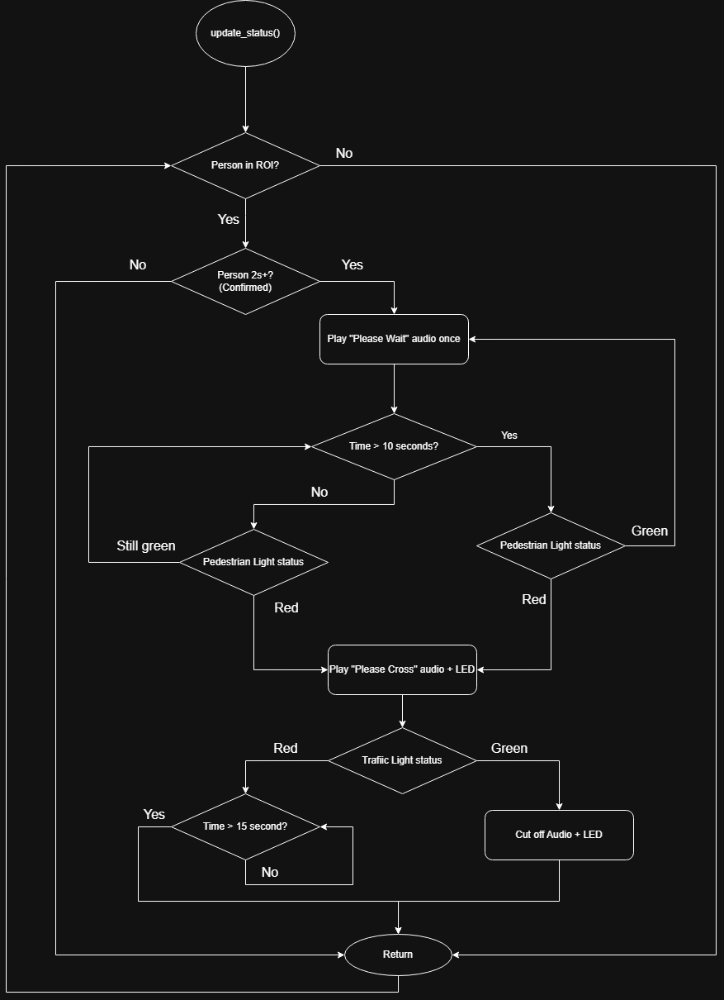

# VisionGuard: Edge AI Pedestrian Safety System


**VisionGuard** is a state-of-the-art, real-time smart surveillance system designed to enhance pedestrian safety at crosswalks and industrial zones. Leveraging the cutting-edge **YOLO26** object detection architecture, it delivers NMS-free, low-latency performance optimized for edge computing devices.

This project was engineered to solve the "blind spot" problem in urban environments by autonomously detecting pedestrians and traffic signals, triggering visual and audio alerts to prevent accidents.

## 🚀 Key Features

*   **⚡ Next-Gen AI Performance**: Powered by **YOLO26 (Nano)**, featuring an NMS-free architecture for faster inference and lower latency on edge devices.
*   **👁️ Smart Perception**: Simultaneous detection of multiple classes:
    *   Pedestrians (with ROI filtering)
    *   Traffic Lights (State recognition: Red/Green)
*   **🎨 Professional Dashboard**: A completely responsive, modern web interface featuring:
    *   **Glassmorphism UI** with dark mode default.
    *   Real-time multi-camera streaming.
    *   Interactive ROI (Region of Interest) drawing tools.
    *   Live environmental sensor data (Temperature, Humidity, Voltage).
*   **🔊 Autonomous Response**:
    *   **Audio Alerts**: Automated voice warnings ("Caution", "Stop") via hardware relay.
    *   **Visual Signaling**: GPIO-controlled LED Warning Systems.
- **💾 Intelligent Recording**: Automated loop recording with localized storage and easy playback retrieval.
- **💻 Cross-Platform**: Runs seamlessly on **Raspberry Pi 4/5** and **Windows** (Simulation Mode).

## 🏗️ System Architecture & Workflow

VisionGuard operates on a high-concurrency, multithreaded architecture designed for real-time edge processing:

### 1. High-Level Workflow


### 2. Operational Breakdown
1.  **Initialization**: The system initializes the hardware abstraction layer (HAL), falling back to simulation mode if GPIO libraries are missing. It then loads the **YOLO26n** model optimized for the specific device.
2.  **Detection Pipeline**: Each camera stream runs in an isolated thread. Frames are captured, passed through the YOLO26 model, and then filtered by User-Defined **ROI (Region of Interest)** polygons.
3.  **Global State Management**: Detection results (e.g., "Pedestrian in Zone A") are synchronized across a thread-safe global state.
4.  **Autonomous Response**: The `MessageManager` monitors the global state and executes pre-defined safety logic:
    *   **Go Mode**: Triggered when a green light is detected with pedestrians waiting.
    *   **Stop Mode**: Triggered when red lights or hazardous crossing conditions are detected.
5.  **User Visualization**: The Flask-based dashboard provides a low-latency MJPEG stream and interactive tools for real-time monitoring and ROI configuration.

## 🛠️ Technical Stack

- **Core AI**: `Ultralytics YOLO26`, `PyTorch`, `OpenCV`
- **Backend**: `Flask`, `Threading (Concurrent Streams)`
- **Frontend**: `HTML5`, `CSS3 (Variables/Grid)`, `Bootstrap 5`, `JavaScript (ES6)`
- **Hardware Integration**: `RPi.GPIO`, `gpiod`, `Adafruit_DHT`, `I2C (ADS1115)`

## ⚙️ Hardware Configuration

This system is optimized for the following Raspberry Pi deployment:

| Component | Specification |
|-----------|---------------|
| **SBC** | Raspberry Pi 5 (4GB/8GB) |
| **Cameras** | 3× USB Webcams (indices 0, 2, 4) |
| **Storage** | PCIe SSD (mounted at `/media/pi/rootfs`) |
| **Audio** | USB Speaker + GPIO Relay (Pin 27) |
| **Visual Alert** | LED Warning Light (GPIO Pin 17) |
| **Sensors** | DHT11 (Temp/Humidity), ADS1115 (Battery Voltage) |

> **Note**: Recordings are stored on the external SSD (`/media/pi/rootfs/recordings`) to avoid filling up the Pi's internal storage and to enable higher I/O performance for continuous video recording.

## 🔧 Installation

### Prerequisites
- Python 3.9+
- Webcam or USB Camera

### Quick Start

1.  **Clone the Repository**
    ```bash
    git clone https://github.com/AimanRosman/Pedestrian-AI-Guard.git
    cd Pedestrian-AI-Guard
    ```

2.  **Install Dependencies**
    ```bash
    pip install -r requirements.txt
    ```

3.  **Run the System**
    ```bash
    python main.py
    ```
    *The system will automatically download the `yolo26n.pt` model on the first run.*

4.  **Access Dashboard**
    Open your browser and navigate to: `http://localhost:8080`

## 🖥️ Usage

### Drawing Detection Zones
1.  Navigate to the **Settings** or **Dashboard** tab.
2.  Click **"Configure ROI Zones"**.
3.  Select a zone type (Red Light, Green Light, or Pedestrian).
4.  Draw a polygon on the camera feed to define the active detection area.

### System Configuration
*   **AI Confidence**: Adjust the detection sensitivity sliding bar.
*   **Low Power Mode**: Toggle to reduce resolution and FPS for energy saving.
*   **Simulation Mode**: On Windows, the system automatically mocks GPIO calls, allowing full UI testing without hardware.

## 📈 Performance

| Platform | Model | Resolution | FPS (Approx) |
|----------|-------|------------|--------------|
| PC (CPU) | YOLO26n | 640x480 | 30+ |
| RPi 5 | YOLO26n | 640x480 | 15-20 |
| Jetson Nano | YOLO26n | 640x480 | 25+ |

## 🛡️ License

This project is licensed under the MIT License - see the [LICENSE](LICENSE) file for details.

---
*Built with ❤️ by Aiman Rosman*
